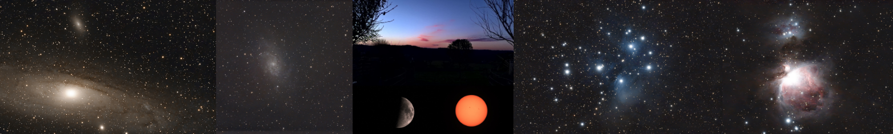

<p align="center">
  <br>
</p>

# METHODS.md — dwarf3 Processing Algorithms

**Version:** 0.22.0-beta
**Last Updated:** 2025-12-29

This document provides detailed descriptions of all processing algorithms used in the `dwarf3` library. It is intended for reproducibility, scientific review, and citation.

**Author:** Olivier Vitrac, PhD, HDR
**Contact:** olivier.vitrac@gmail.com
**Affiliation:** Generative Simulation Initiative

---

## Table of Contents

1. [FITS Decoding](#1-fits-decoding)
2. [Frame Discovery and Exclusion](#2-frame-discovery-and-exclusion)
3. [Quality Scoring](#3-quality-scoring)
4. [Acquisition Modes](#4-acquisition-modes)
5. [Debayering](#5-debayering)
6. [Registration](#6-registration)
7. [Stacking](#7-stacking)
8. [Color Processing](#8-color-processing)
9. [Visualization](#9-visualization)
10. [Complete Pipeline Examples](#10-complete-pipeline-examples)

---

## 1. FITS Decoding

### 1.1 Unsigned 16-bit Representation

DWARF 3 stores unsigned 16-bit sensor data using the standard FITS offset convention:

| Header | Value | Description |
|--------|-------|-------------|
| `BITPIX` | 16 | Signed 16-bit storage |
| `BZERO` | 32768 | Offset for unsigned representation |
| `BSCALE` | 1 | Scale factor (unity) |

Physical pixel values are computed as:

$$\text{value} = \text{stored\_data} \times \text{BSCALE} + \text{BZERO}$$

The library converts all data to `float32` for processing to prevent integer overflow during arithmetic operations.

### 1.2 Implementation

```python
from dwarf3 import read_fits

# Returns float32 array with BZERO/BSCALE applied
data = read_fits("path/to/frame.fits")
```

The `astropy.io.fits` module handles BZERO/BSCALE automatically when `do_not_scale_image_data=False` (default).

---

## 2. Frame Discovery and Exclusion

### 2.1 File Enumeration

The `list_lights()` function discovers valid light frames:

1. Enumerate all `*.fits` files in the session folder
2. **Exclude** files matching `failed_*.fits` (device-flagged failures)
3. **Exclude** files matching `stacked-*.fits` (device-produced stacks)
4. Sort remaining files by name (chronological order)

### 2.2 Rationale

DWARF 3 marks frames with tracking failures or other issues using the `failed_` prefix. These are excluded by default to prevent degrading stack quality. Device-produced stacks (`stacked-*.fits`) are excluded to process only raw data.

```python
from dwarf3 import list_lights

frames = list_lights("rawData/DWARF_RAW_TELE_M31_...")
# Returns: ['frame_0001.fits', 'frame_0002.fits', ...]
```

---

## 3. Quality Scoring

### 3.1 Individual Metrics

Each frame is evaluated using fast, explainable metrics:

| Metric | Formula | Description |
|--------|---------|-------------|
| Background median | $\tilde{x} = \text{median}(I)$ | Sky brightness proxy |
| Background MAD | $\text{MAD} = \text{median}(\|I - \tilde{x}\|)$ | Robust scatter estimate |
| Noise proxy | $\sigma \approx 1.4826 \times \text{MAD}$ | Gaussian-equivalent noise |
| Saturation fraction | $f_{\text{sat}} = \frac{\#(I > 0.95 \cdot I_{\max})}{N}$ | Clipped pixel ratio |
| Star proxy | Connected components above threshold | Focus/tracking quality |

### 3.2 Composite Score

The composite score balances all factors:

$$\text{score} = \frac{1 + \text{star\_proxy}}{\text{noise} \times (1 + 10 \times \text{saturation}) \times (1 + \text{bg\_normalized})}$$

Higher scores indicate better frames. The formula penalizes:
- High noise (denominator)
- Saturated pixels (10× weight in denominator)
- Bright backgrounds (normalized to [0,1])

### 3.3 Frame Selection

Frames are ranked by composite score (descending) and the top `keep_fraction` are retained:

```python
from dwarf3 import select_frames, StackConfig

config = StackConfig(keep_fraction=0.92)
kept, rejected = select_frames(frame_paths, config=config)
```

Default `keep_fraction=0.92` matches typical DWARF 3 internal selection (e.g., 470/510 frames).

---

## 4. Acquisition Modes

DWARF 3 supports two tracking modes that fundamentally affect how frames must be processed:

### 4.1 Alt-Az Mode (Alt-Azimuth Mount)

**Characteristics:**
- Telescope tracks by adjusting altitude and azimuth axes
- Field rotation occurs during long exposures
- Rotation rate depends on target declination and observation time

**Field Rotation Formula:**

$$\omega = \frac{15'' \cos\phi \cos A}{\cos h}$$

Where $\phi$ is observer latitude, $A$ is azimuth, and $h$ is altitude. For M31 at mid-latitudes over 2.5 hours, rotation can exceed 80°.

**Processing Strategy:**
1. **Debayer first** — Convert Bayer mosaic to RGB before alignment
2. **Full affine transforms** — Handle rotation, translation, and scale
3. **Mask-aware stacking** — Track per-pixel validity due to frame rotation
4. **Edge feathering** — Smooth transitions at rotated frame boundaries

```bash
# Alt-Az mode processing (default)
python scripts/process_session.py "rawData/DWARF_RAW_TELE_M 31_..." \
    --out processedData --keep 0.92 --sigma 3.0
```

**Advantages:**
- Full affine registration handles any rotation
- Works for any session length

**Disadvantages:**
- Interpolation during debayer and transform can blur fine detail
- More computationally intensive

### 4.2 EQ Mode (Equatorial Mount)

**Characteristics:**
- Telescope tracks by rotating around polar axis
- No field rotation (or minimal, if polar alignment is imperfect)
- Frame shifts are primarily translation with negligible rotation

**Processing Strategy:**
1. **Integer-pixel Bayer-safe alignment** — Round shifts to even pixel values
2. **Stack in Bayer domain** — Preserve raw sensor data through stacking
3. **Debayer once** — Apply debayer only to final stacked result

**Bayer Grid Preservation:**

The RGGB pattern repeats every 2 pixels. To preserve color integrity:

$$\Delta x_{\text{aligned}} = 2 \times \text{round}\left(\frac{\Delta x_{\text{computed}}}{2}\right)$$

$$\Delta y_{\text{aligned}} = 2 \times \text{round}\left(\frac{\Delta y_{\text{computed}}}{2}\right)$$

This ensures R pixels always align with R pixels, G with G, B with B.

```bash
# EQ mode processing
python scripts/process_session.py "rawData/DWARF_RAW_TELE_M 43_..." \
    --out processedData --keep 0.92 --sigma 3.0 --eq-mode
```

**Advantages:**
- Sharper results (no interpolation until final debayer)
- Faster processing (simpler transforms)
- Better color fidelity (Bayer grid preserved)

**Disadvantages:**
- Only works when rotation is negligible
- Requires good polar alignment

### 4.3 Mode Selection Guidelines

| Scenario | Recommended Mode | Rationale |
|----------|-----------------|-----------|
| Short sessions (< 30 min) | EQ mode | Minimal rotation even in alt-az |
| Long sessions with polar tracking | EQ mode | Designed for this case |
| Long sessions without polar tracking | Alt-Az mode | Handles field rotation |
| Unknown or mixed sessions | Alt-Az mode | More robust (handles rotation if present) |

### 4.4 Automatic Mode Detection (Future)

Future versions may implement automatic detection by analyzing transform matrices:
- If all transforms have rotation < 0.1°: suggest EQ mode
- If significant rotation detected: require Alt-Az mode

---

## 5. Debayering

### 5.1 RGGB Bayer Pattern

DWARF 3 uses the RGGB Bayer pattern:

```
Row 0: R  G  R  G  ...
Row 1: G  B  G  B  ...
Row 2: R  G  R  G  ...
```

Each 2×2 block contains: 1 Red, 2 Green, 1 Blue pixel.

### 5.2 Superpixel Debayering

**Mode:** `debayer="superpixel"`

Fast, robust method producing half-resolution output:

$$\text{RGB}_{i,j} = \begin{pmatrix} R_{2i,2j} \\ \frac{G_{2i,2j+1} + G_{2i+1,2j}}{2} \\ B_{2i+1,2j+1} \end{pmatrix}$$

- **Output size:** $(H/2, W/2, 3)$
- **Advantages:** Best SNR, no interpolation artifacts
- **Use case:** Quick previews, luminance extraction

### 5.3 Bilinear Debayering

**Mode:** `debayer="bilinear"`

Full-resolution interpolation using normalized convolution:

For each color channel at each pixel position, missing values are interpolated from neighbors using cross (+) or diagonal (×) kernels:

$$\text{value}(x,y) = \frac{\sum_{(i,j) \in N} w_{ij} \cdot I_{ij}}{\sum_{(i,j) \in N} w_{ij}}$$

Where $N$ is the neighborhood of pixels with the same color and $w_{ij}$ are kernel weights.

**Critical implementation detail:** Division must be by the actual count of contributing pixels, not a fixed factor. This prevents the "checkerboard pattern" artifact at Bayer boundaries.

```python
# Normalized convolution (correct)
sum_vals = convolve(data_plane, kernel)
sum_counts = convolve(count_mask, kernel)
result = sum_vals / sum_counts  # Per-pixel normalization
```

- **Output size:** $(H, W, 3)$
- **Advantages:** Full resolution
- **Use case:** Final stacking, color preservation during rotation

### 5.4 Luminance Extraction

For registration, a luminance proxy can be extracted directly from Bayer data:

```python
from dwarf3 import bayer_luma_rggb

# Green-channel average (best SNR)
luma = bayer_luma_rggb(bayer_data)  # Shape: (H/2, W/2)
```

Uses green pixels only (2 per 2×2 block) for optimal signal-to-noise.

---

## 6. Registration

### 6.1 Star-Based Alignment (astroalign)

Default method using asterism matching:

1. Detect point sources (stars) in each frame
2. Form triangles from brightest stars
3. Match triangle patterns between frames
4. Compute affine transformation (rotation, translation, scale)

```python
from dwarf3 import register_to_reference, select_reference_frame

ref_idx = select_reference_frame(frames, scores)
aligned, transforms = register_to_reference(frames, ref_idx)
```

### 6.2 Parallel Alignment

For large datasets, parallel alignment distributes work across CPU cores:

```python
from dwarf3 import align_rgb_debayer_first_parallel

# Parallel debayer + alignment
aligned_frames, results = align_rgb_debayer_first_parallel(
    frame_paths,
    reference_rgb,
    reference_path,
    debayer_mode="bilinear",
    workers=None,  # Auto-detect CPU count
)
```

Implementation uses `ProcessPoolExecutor` with worker functions that:
1. Read raw Bayer frame
2. Apply bilinear debayer
3. Extract luminance for registration
4. Compute transform via astroalign
5. Apply transform to RGB data

### 6.3 Alt-Az Field Rotation

DWARF 3 uses an alt-azimuth mount, causing field rotation during long sessions:

$$\theta(t) = \arctan\left(\frac{\cos\phi \sin h}{\sin\phi \cos\delta - \cos\phi \sin\delta \cos h}\right)$$

Where $\phi$ is latitude, $\delta$ is declination, and $h$ is hour angle.

For M31 at typical mid-latitude locations, rotation can exceed 80° over a 2.5-hour session. This requires:
- Full affine registration (not just translation)
- Mask-aware stacking (see Section 7.2)

### 6.4 Transform Persistence

Transforms are saved for reproducibility:

```python
from dwarf3 import save_transforms, load_transforms

save_transforms(transforms, "session/transforms.json")
transforms = load_transforms("session/transforms.json")
```

---

## 7. Stacking

### 7.1 Sigma-Clipped Mean

Standard stacking algorithm for outlier rejection:

**Algorithm:**
1. For each pixel position across N aligned frames
2. Compute $\mu = \text{mean}$, $\sigma = \text{std}$
3. Mask values where $|x - \mu| > k\sigma$
4. Repeat steps 2-3 for `maxiters` iterations
5. Final value = mean of unmasked values

**Parameters:**
- $k = 3.0$ (sigma threshold, default)
- `maxiters = 5` (iteration limit)

```python
from dwarf3 import sigma_clip_mean

stacked = sigma_clip_mean(aligned_frames, sigma=3.0, maxiters=5)
```

This rejects:
- Cosmic rays
- Satellite trails
- Hot pixels
- Transient artifacts

### 7.2 Mask-Aware Stacking

**Problem:** When frames are rotated, corners/edges become invalid (black). Standard averaging divides by total N, but rotated corners have fewer valid samples.

**Solution:** Weight by validity mask:

$$\text{stacked}(x,y) = \frac{\sum_{i=1}^{N} \text{frame}_i(x,y) \cdot \text{mask}_i(x,y)}{\sum_{i=1}^{N} \text{mask}_i(x,y)}$$

Where $\text{mask}_i(x,y) = 1$ if pixel is valid (inside rotated frame bounds), 0 otherwise.

```python
from dwarf3 import sigma_clip_mask_aware_rgb

# Masks are automatically computed from frame validity
stacked, coverage = sigma_clip_mask_aware_rgb(
    aligned_frames,
    masks=None,  # Auto-compute from frame bounds
    sigma=3.0,
    maxiters=5,
)
```

**Output:**
- `stacked`: RGB image with proper weighting
- `coverage`: Per-pixel sample count map

### 7.3 Coverage Map

The coverage map shows how many frames contribute to each pixel:

$$\text{coverage}(x,y) = \sum_{i=1}^{N} \text{mask}_i(x,y)$$

Center pixels have full coverage (N), corners have reduced coverage due to rotation. This is useful for:
- Quality assessment
- Uncertainty estimation
- Cropping decisions

---

## 8. Color Processing

### 8.1 Bayer Compensation

RGGB pattern has 2 green pixels per 2×2 block. After debayering, green may appear stronger. Auto-compensation estimates channel gains:

```python
from dwarf3 import apply_bayer_compensation

rgb_balanced = apply_bayer_compensation(rgb, auto=True)
```

**Auto mode algorithm:**
1. Sample background (percentile 10-50 to avoid stars)
2. Compute channel medians: $\tilde{R}, \tilde{G}, \tilde{B}$
3. Compute gains: $g_R = \tilde{G}/\tilde{R}$, $g_B = \tilde{G}/\tilde{B}$
4. Clamp gains to [0.5, 2.0] for safety
5. Apply: $R' = R \cdot g_R$, $B' = B \cdot g_B$

### 8.2 White Balance

Full white balance using gray-world or background reference:

```python
from dwarf3 import compute_white_balance, calibrate_rgb

gains = compute_white_balance(rgb, method="gray_world")
rgb_wb = calibrate_rgb(rgb, gains)
```

### 8.3 SCNR (Green Cast Removal)

Subtractive Chromatic Noise Reduction for residual green cast:

```python
from dwarf3 import scnr_green

# Amount: 0.0 (none) to 1.0 (full removal)
rgb_clean = scnr_green(rgb, amount=0.5)
```

**Algorithm:** For each pixel where $G > \max(R, B)$:

$$G' = G - \text{amount} \cdot (G - \max(R, B))$$

### 8.4 LAB Color Space Correction

For fine color tuning, LAB color space provides independent control:

- **L channel:** Luminosity (brightness)
- **a channel:** Green ↔ Magenta axis
- **b channel:** Blue ↔ Yellow axis

```python
import cv2

# Convert to LAB
lab = cv2.cvtColor((rgb * 255).astype(np.uint8), cv2.COLOR_RGB2LAB)
L, a, b = cv2.split(lab)

# Shift a-channel (positive = more magenta, less green)
a = np.clip(a.astype(np.float32) + 2.0, 0, 255).astype(np.uint8)

# Boost chroma (saturation)
a = np.clip((a.astype(np.float32) - 128) * 1.3 + 128, 0, 255).astype(np.uint8)
b = np.clip((b.astype(np.float32) - 128) * 1.3 + 128, 0, 255).astype(np.uint8)

# Convert back
lab = cv2.merge([L, a, b])
rgb_corrected = cv2.cvtColor(lab, cv2.COLOR_LAB2RGB)
```

---

## 9. Visualization

### 9.1 Asinh Stretch

The inverse hyperbolic sine function provides soft compression:

$$\text{stretched} = \frac{\sinh^{-1}(a \cdot x)}{\sinh^{-1}(a)}$$

Where:
- $x$ is normalized input $\in [0, 1]$
- $a$ controls stretch intensity (default: 5.0)

**Properties:**
- Linear for small values: $\sinh^{-1}(ax) \approx ax$ when $ax \ll 1$
- Logarithmic for large values: $\sinh^{-1}(ax) \approx \ln(2ax)$ when $ax \gg 1$

This makes both faint nebulosity and bright stars visible.

```python
from dwarf3 import asinh_stretch

preview = asinh_stretch(linear_data, a=5.0)
```

### 9.2 Percentile Normalization

Before stretching, data is normalized using percentiles:

```python
from dwarf3 import linear_stretch

# Clip to 1st-99.5th percentile, then scale to [0,1]
normalized = linear_stretch(data, low_pct=1.0, high_pct=99.5)
```

### 9.3 Two-Stage Stretch

For challenging data (faint nebulae with bright stars):

1. **Stage 1:** Gentle background stretch (low $a$)
2. **Stage 2:** Stronger highlight compression (higher $a$)

```python
from dwarf3 import two_stage_stretch

preview = two_stage_stretch(
    data,
    background_stretch=2.0,
    highlight_stretch=8.0,
    transition_point=0.3,
)
```

---

## 10. Complete Pipeline Examples

### 10.1 Basic Monochrome Pipeline

For quick luminance stacking:

```python
from dwarf3 import stack_session, StackConfig

config = StackConfig(
    keep_fraction=0.92,
    sigma=3.0,
    debayer="none",  # Keep Bayer mosaic
)

result = stack_session("rawData/DWARF_RAW_TELE_M31_...", config=config)
print(f"Output: {result.outputs['master_linear']}")
```

### 10.2 RGB Debayer-First Pipeline (Recommended for Color)

For sessions with significant field rotation (alt-az mount), debayer before alignment to preserve color:

```python
from pathlib import Path
import numpy as np
from dwarf3 import (
    list_lights,
    read_fits,
    select_frames,
    debayer_rggb,
    align_rgb_debayer_first_parallel,
    sigma_clip_mask_aware_rgb,
    apply_bayer_compensation,
    asinh_stretch,
    write_fits,
    StackConfig,
)

# 1. Discover and select frames
session = Path("rawData/DWARF_RAW_TELE_M31_EXP_15_GAIN_60_2025-12-27-18-26-56-449")
frame_paths = list_lights(session)
config = StackConfig(keep_fraction=0.92)
kept_paths, rejected = select_frames(frame_paths, config=config)

# 2. Prepare reference frame
ref_path = kept_paths[0]
ref_bayer = read_fits(ref_path)
ref_rgb = debayer_rggb(ref_bayer, mode="bilinear")

# 3. Parallel alignment (debayer + align each frame)
aligned_frames, alignment_results = align_rgb_debayer_first_parallel(
    kept_paths,
    ref_rgb,
    str(ref_path),
    debayer_mode="bilinear",
    workers=None,  # Auto-detect
)

# 4. Mask-aware stacking (handles rotation properly)
stacked_rgb, coverage = sigma_clip_mask_aware_rgb(
    aligned_frames,
    sigma=3.0,
    maxiters=5,
)

# 5. Color correction
balanced = apply_bayer_compensation(stacked_rgb, auto=True)

# 6. Save outputs
output_dir = Path("processedData") / session.name / "stacked"
output_dir.mkdir(parents=True, exist_ok=True)

write_fits(balanced, output_dir / "master_rgb_linear.fits")

# Quicklook
preview = asinh_stretch(balanced, a=5.0)
# Save as PNG/TIFF...
```

### 10.3 LRGB Workflow

Combine high-SNR luminance with color:

```python
from dwarf3 import combine_lrgb, LRGBResult

# Stack luminance (higher weight, more frames)
lum_result = stack_session(session, config=StackConfig(debayer="none"))
luminance = lum_result.outputs["master_linear"]

# Stack RGB (for color information)
rgb_result = stack_session(session, config=StackConfig(debayer="bilinear"))
rgb = rgb_result.outputs["master_rgb"]

# Combine: luminance provides detail, RGB provides color
lrgb = combine_lrgb(luminance, rgb, lum_weight=0.7)
```

---

## References

1. Astropy Collaboration. (2022). The Astropy Project: Sustaining and Growing a Community-oriented Open-source Project and the Latest Major Release (v5.0) of the Core Package. *The Astrophysical Journal*, 935(2), 167.

2. Beroiz, M., Cabral, J. B., & Sanchez, B. (2020). Astroalign: A Python module for astronomical image registration. *Astronomy and Computing*, 32, 100384.

3. Lupton, R. H., Gunn, J. E., & Szalay, A. S. (1999). A Modified Magnitude System that Produces Well-Behaved Magnitudes, Colors, and Errors Even for Low Signal-to-Noise Ratio Measurements. *The Astronomical Journal*, 118(3), 1406-1410.

---

*Document version: 0.22.0-beta (2025-12-29)*
